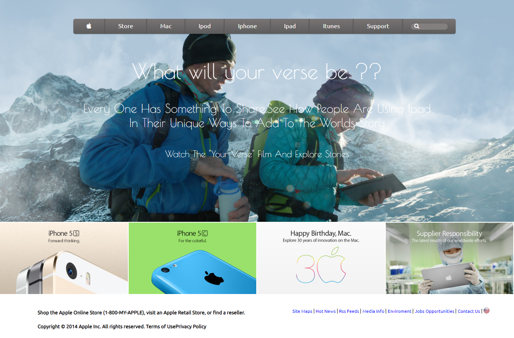

# Building with backgrounds and gradients microverse project.

> This is a clone of apples inc web page. 

The project is created using flex box.

## Built With

- Html Css,
- font-awesome,

## Live Demo

[Live Demo Link](https://rawcdn.githack.com/peterrobert/Building-with-Backgrounds-and-Gradients/a9663d4d44eb8ca7ce0775a83c6945f1824f07ab/index.html)

## Getting Started
To get a local copy up and running follow these simple example steps.

### Setup
Download or clone this repository to your machine.

### Usage
Navigate to the project folder and open the index.html file in your favorite browser.
You can also open it on your favorite code editor and make changes as you wish.

## Authors

👤 **peter robert**

- Github: [@peterrobert](https://github.com/peterrobert)
- Twitter: [@ptahwambui93](https://twitter.com/Ptahwambui93)
- Linkedin: [peter robert ndungu](https://www.linkedin.com/in/peter-rob-ndungu/)

## 🤝 Contributing

Contributions, issues and feature requests are welcome!

Feel free to check the [issues page](issues/).

## Show your support

Give a ⭐️ if you like this project!

## Acknowledgments

- Hat tip to anyone whose code was used
- Inspiration
- etc

## 📝 License
MIT
